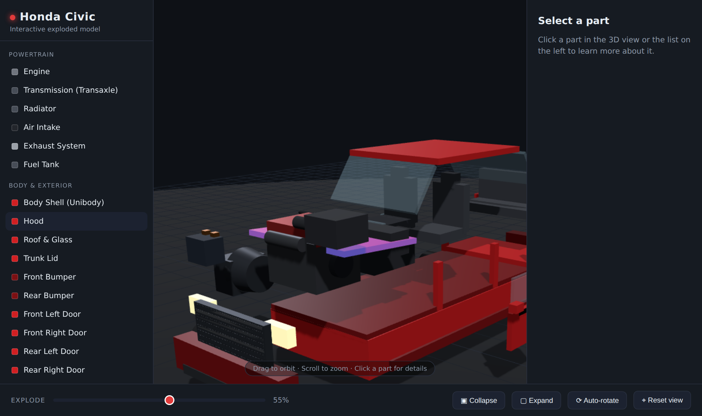

# Honda Civic — Interactive Exploded 3D Model

An interactive, browser-based 3D model of a Honda Civic that you can **expand
and collapse** like an exploded-view diagram. Click any part — engine,
transmission, seats, suspension, doors and more — to highlight it and read a
description with specs.



## Features

- **Explode / collapse** the whole car with a slider, or snap to fully
  assembled / fully exploded with one button.
- **Click any part** (in the 3D view or the list) to highlight it and open a
  details panel with a description and specifications.
- **Orbit, zoom and auto-rotate** the camera; selecting a part re-centers the
  view on it.
- **29 individually modelled parts** across five systems: Powertrain, Body &
  Exterior, Interior, Chassis & Wheels, and Electrical.
- **No build step and fully offline** — Three.js is vendored locally, the car
  is generated procedurally, so there are no external assets to download.

## Running it

Because the app uses ES module imports, browsers block it over `file://`. Serve
the folder with any static web server and open the page:

```bash
# from the project root
python3 -m http.server 8000
# then visit http://localhost:8000
```

Any equivalent works too (`npx serve`, the VS Code "Live Server" extension,
etc.).

## How it works

| File | Responsibility |
| --- | --- |
| `index.html` | Page layout, the import map pointing at vendored Three.js |
| `css/styles.css` | UI styling (sidebar, details panel, controls) |
| `js/parts.js` | Procedural geometry + metadata for every part |
| `js/main.js` | Scene, lighting, raycasting, explode animation, UI wiring |
| `js/vendor/three/` | Vendored Three.js (`r160`) + `OrbitControls` |

Each part is a `THREE.Group` whose child meshes are placed at their true
assembled position. To "explode", every group is translated along a
per-part direction vector scaled by the slider value, so at 0% everything
nests back into a complete car. Each mesh gets its own cloned material so the
hover/selection highlight stays isolated to a single part.

### Adding or editing a part

Parts live in the `defs` array in `js/parts.js`. A part looks like:

```js
{
  id: "engine",
  name: "Engine",
  category: "Powertrain",
  explode: [0, 1.7, 1.0],      // direction it flies out when exploded
  build: () => buildEngine(M), // returns a THREE.Group at world coordinates
  info: {
    desc: "…",
    specs: [["Layout", "Inline-4, transverse"], …],
  },
}
```

Add an entry (and a small `build…` helper) and it automatically appears in the
sidebar, becomes clickable, and participates in the explode animation.

> The geometry is a stylised representation for visualisation and learning —
> dimensions and specs are approximate, not engineering data.
